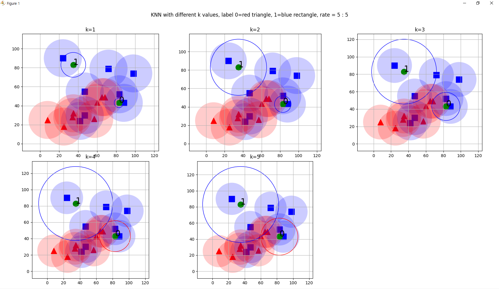
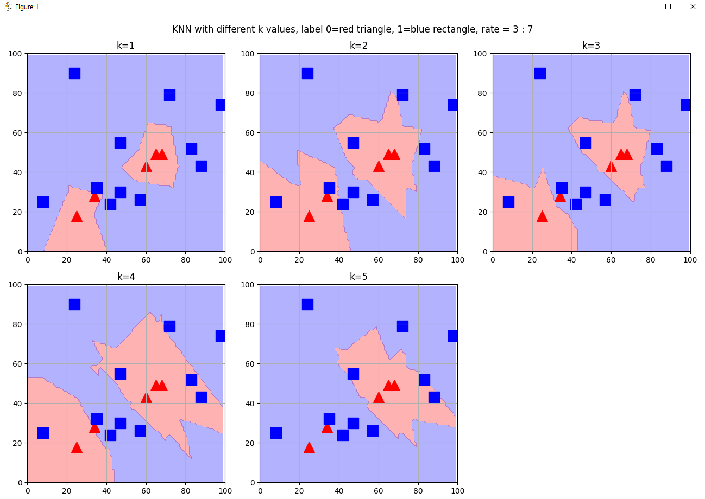
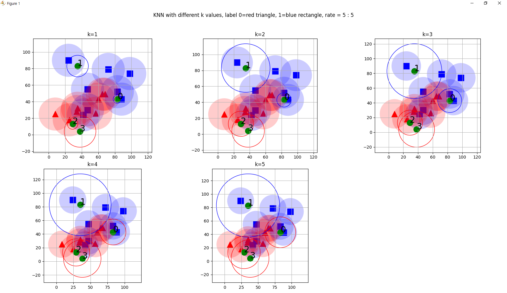
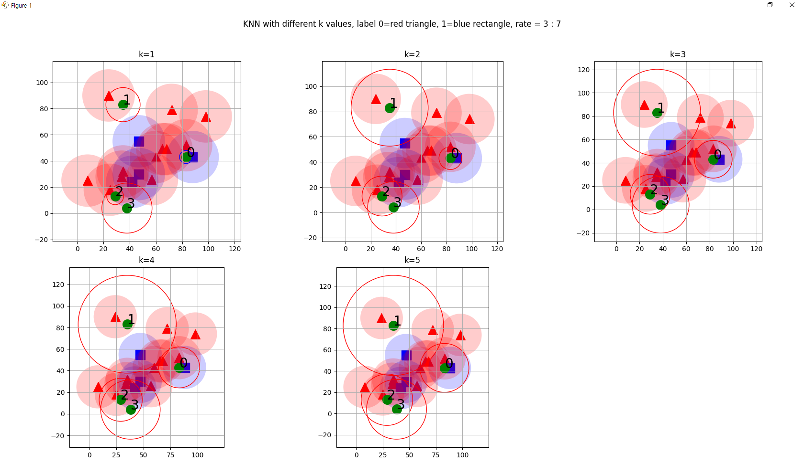

# SVM1
## 1. 문제 요약
> ### &nbsp;&nbsp;&nbsp;&nbsp;실험적으로 이를 확인하는 간접적인 방법은 query data point를 k=2, 4..일 때<br/>전 영역으로 확장하여 색칠을 해보면 알게 될 것으로 보인다.
>  
> > + #### 모든 실험에 같은 학습 데이터를 사용하게 만들어야 한다. -> seed() 함수
> > + #### 학습 데이터의 레이블의 분포(비율)를 통제할 수 있어야 한다. -> choice() 함수


## <br/> 2. 코드
```python
import cv2
import numpy as np
import matplotlib.pyplot as plt
import matplotlib.patches as patches

N = 16
T = 2
K = 5   # 1 ~ 5 범위

np.random.seed(370001)
data = np.random.randint(0, 100, (N, 2)).astype(np.float32)

'''
# 3 : 7 비율
labels = np.zeros((N, 1), dtype=np.float32)
num_class_1 = int(N * 0.3)
labels[:num_class_1] = 1
rate = "3 : 7"
'''

# 5 : 5 비율
labels = np.zeros((N, 1), dtype=np.float32)
num_class_1 = N // 2
labels[:num_class_1] = 1
rate = "5 : 5"

# 섞어서 랜덤하게 배치
indices = np.random.choice(N, N, replace=False)
data = data[indices]
labels = labels[indices]

# 테스트 데이터 생성
sample_arr = [np.random.randint(0, 100, (1, 2)).astype(np.float32) for _ in range(T)]

# 서브플롯 생성 (2행 K//2 + 1열)
fig, axs = plt.subplots(2, (K + 1) // 2, figsize=(15, 10))
fig.suptitle(f'KNN with different k values, label 0=red triangle, 1=blue rectangle, rate = {rate}')

# 화면 출력
for k in range(1, K + 1):
    ret_arr = []
    results_arr = []
    neighbours_arr = []
    dist_arr = []

    for sample in sample_arr:
        knn = cv2.ml.KNearest_create()
        knn.train(data, cv2.ml.ROW_SAMPLE, labels)
        ret, result, neighbors, dist = knn.findNearest(sample, k)

        ret_arr.append(ret)
        results_arr.append(result)
        neighbours_arr.append(neighbors)
        dist_arr.append(dist)

    ax = axs[(k - 1) // ((K + 1) // 2), (k - 1) % ((K + 1) // 2)]
    ax.set_title(f'k={k}')

    red_triangles = data[labels.ravel() == 0]
    ax.scatter(red_triangles[:, 0], red_triangles[:, 1], 200, 'r', '^')

    blue_squares = data[labels.ravel() == 1]
    ax.scatter(blue_squares[:, 0], blue_squares[:, 1], 200, 'b', 's')

    # 데이터 포인트 위에 원 그리기
    for point, label in zip(data, labels.ravel()):
        color = 'r' if label == 0 else 'b'
        circle = patches.Circle((point[0], point[1]), radius=20, facecolor=color, alpha=0.2)
        ax.add_patch(circle)

    # 테스트 데이터 표시
    for i, sample in enumerate(sample_arr):
        tmp_dist = dist_arr[i]
        dist_max = np.sqrt(tmp_dist[0, k - 1])
        sample = np.int32(sample)
        color = 'r' if ret_arr[i] == 0.0 else 'b'
        shp = patches.Circle((sample[0, 0], sample[0, 1]), radius=dist_max, color=color, fill=False)
        ax.text(sample[0, 0], sample[0, 1], s=str(i), fontsize=20)
        ax.add_patch(shp)

    # 테스트 데이터 좌표에 초록색 점 추가
    for sample in sample_arr:
        ax.scatter(sample[:, 0], sample[:, 1], 200, 'g', 'o')

    ax.axis('scaled')
    ax.grid(True)

# 숨겨진 서브플롯 제거
if K % 2 != 0:
    fig.delaxes(axs[1, (K) // 2])

plt.tight_layout(rect=[0, 0, 1, 0.96])  # 제목 공간 확보
plt.show()

```
## <br/> 3. 결과
> + ### 실행 초기 상태(N = 16, T = 2, 5:5 비율)
> 
> + ### 3:7 비율
> 
> - - -
> + ### N = 16, T = 4, 5:5 비율
> 
> + ### 3:7 비율
> 

## <br/> 4. 결론
> + #### 각 학습 데이터의 좌표를 기준으로 alpha=0.2인 원을 생성. 
> + #### 테스트 데이터의 좌표를 기준으로 k에 해당되는 최대 거리의 원을 형성.
> + #### k = 1~5 까지의 현상을 하나의 pyplot로 표현
> + #### 3:7, 5:5 의 비율을 코드의 수정을 통해 시각화 가능
