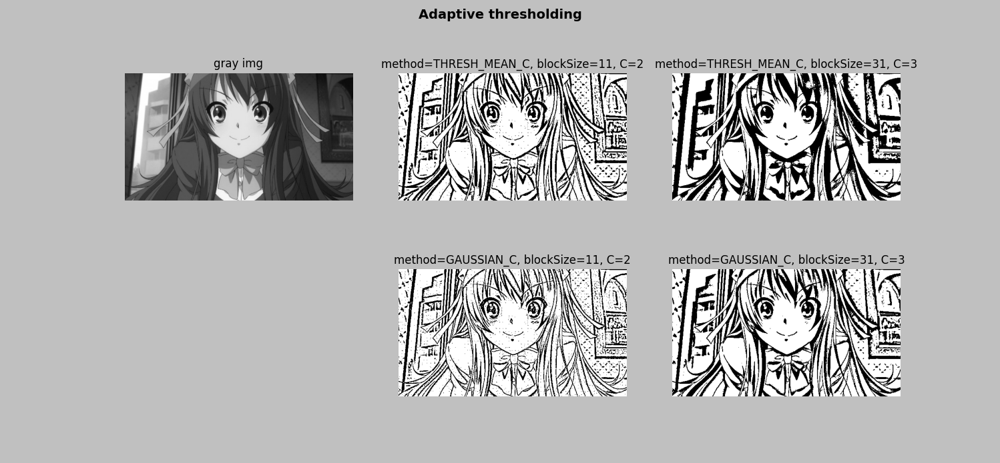
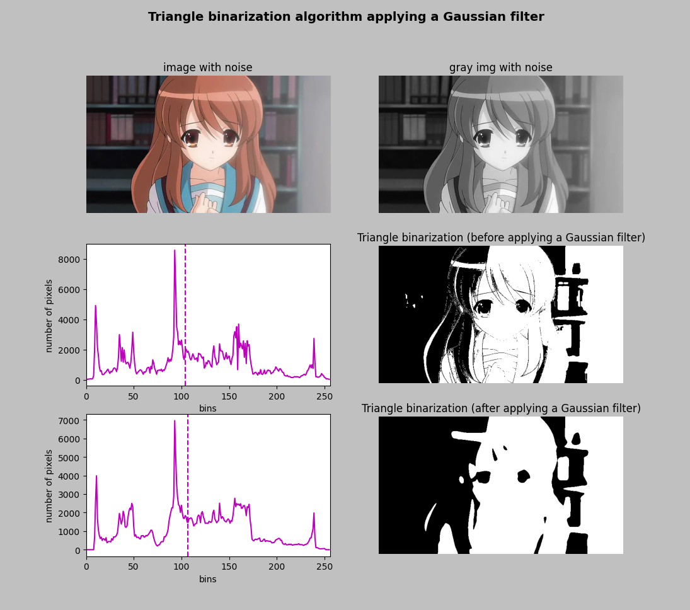

## Adaptive thresholding example
+ ##### 적응 임계값 처리를 통해 다양한 조건에서도 이미지의 임계값을 효과적으로 결정 가능
   
- - -
## Thresholding otsu example
+ ##### 최적의 임계값을 찾아 이진화
</img>   
- - -
## Thresholding triangle filter noise example
+ ##### 삼각형 모양의 임계값을 자동으로 완성하여 이미지를 이진화
   
- - -
## Thresholding bgr example
+ ##### 각 채널별로 이진화를 시켜 통합하여 이미지를 생성
   
- - -
## Thresholding scikit-image (Otsu's binarization example)
+ ##### Otsu's scikit-image 알고리즘을 이용한 Thresholding
_kyon.png)   
- - -
