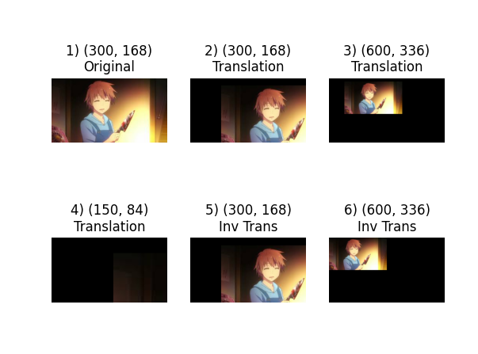
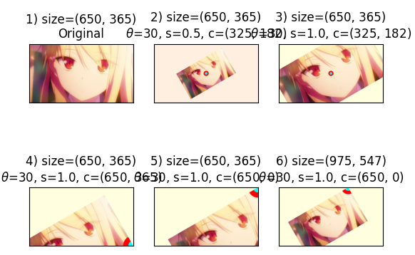
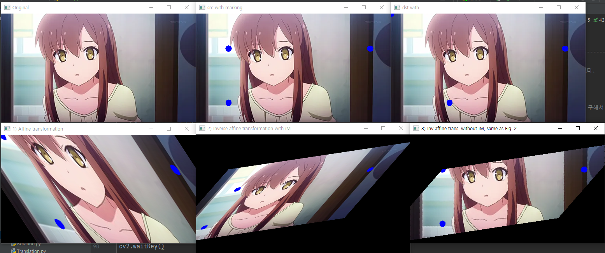

## Translation example
+ ##### warpAffine() 함수를 사용하여 영상을 변환.
+ ##### cv2.invertAffineTransform() 함수로 역행렬을 통해 원래 영상으로 복원할 수 있음.

## Rotation example
+ ##### cv2.getRotationMatrix2D() 함수를 통해 Rotation 행렬 반환 받음.
+ ##### center 좌표를 어디에 정하느냐에 따라 결과가 달라지는 것을 보여줌.

## Affine example
+ ##### cv2.getAffineTransform(pts_src, pts_dst) 함수를 통해 affine 행렬을 반환 받음.
+ ##### cv2.invertAffineTransform(matrix), cv2.warpAffine(..., flags=cv2.WARP_INVERSE_MAP) 등의 함수로 변형된 영상을 복원함

