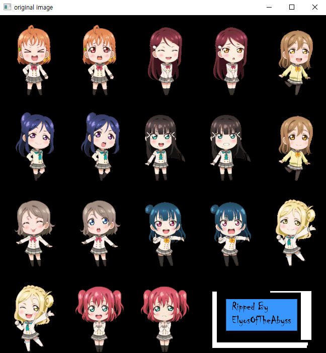
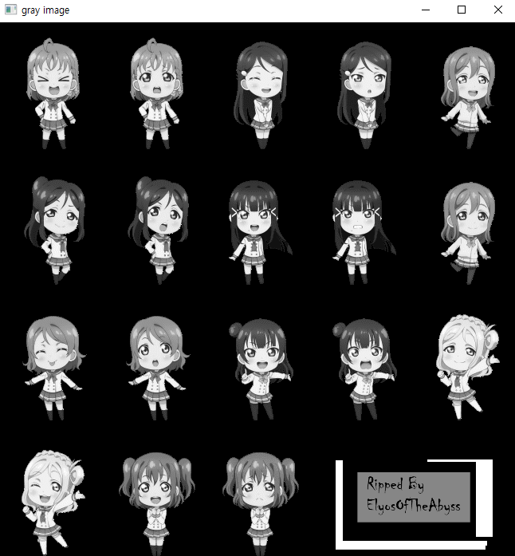
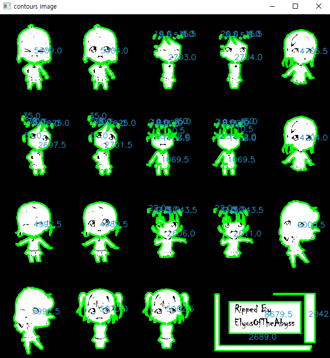

## contourArea example
+ ##### cv2.contourArea(contour) 함수로 contours의 각 contour 영역의 넓이를 구함.
+ ##### cv2.putText() 함수를 통해 각 contour 그룹에 해당하는 contourArea를 출력함.

- - -
## Rotation example
+ ##### cv2.getRotationMatrix2D() 함수를 통해 Rotation 행렬 반환 받음.
+ ##### center 좌표를 어디에 정하느냐에 따라 결과가 달라지는 것을 보여줌.

- - -
## Affine example
+ ##### cv2.getAffineTransform(pts_src, pts_dst) 함수를 통해 affine 행렬을 반환 받음.
+ ##### cv2.invertAffineTransform(matrix), cv2.warpAffine(..., flags=cv2.WARP_INVERSE_MAP) 등의 함수로 변형된 영상을 복원함

- - -
## Perspective example
+ ##### cv2.getPerspectiveTransform(src, dst) 함수를 통해 perspective 행렬을 반환 받음.
+ ##### cv2.getPerspectiveTransform(dst, src) 함수로 변형된 영상을 복원함

- - -

