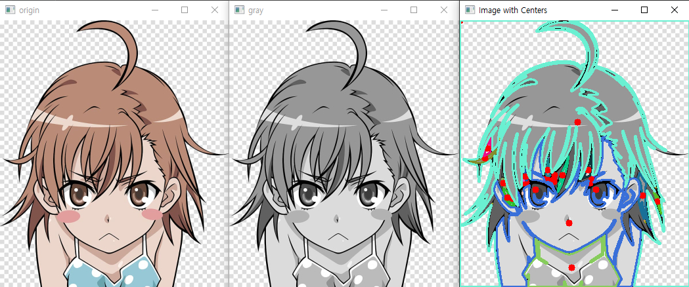

## momnet example
+ ##### cv2.moment(contour) 함수로 이미지의 특징을 추출함.
+ ##### cv2.circle() 함수를 이용하여 각 컨투어의 중심점에 빨간색 중심점 표시.

- - -
## contours sort example
+ ##### contoursArea()의 결과를 정렬시켜 크기 순서를 화면에 출력
+ ##### 숫자가 클수록 면적이 넓다

- - -
