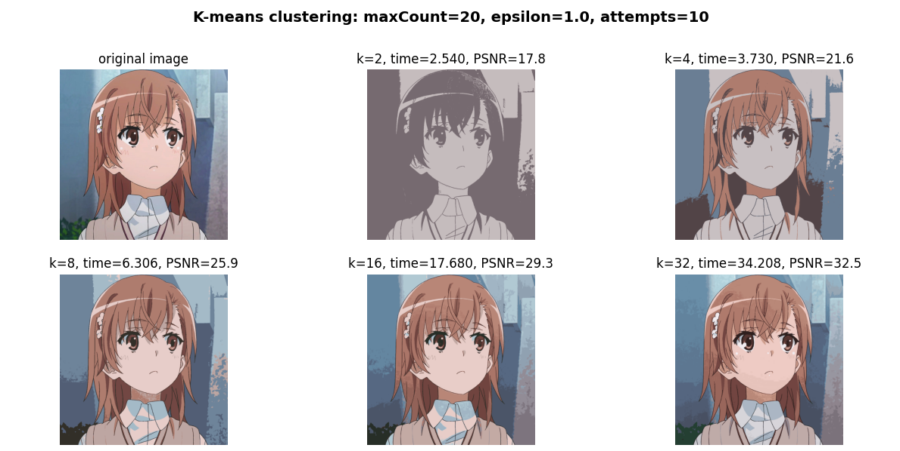
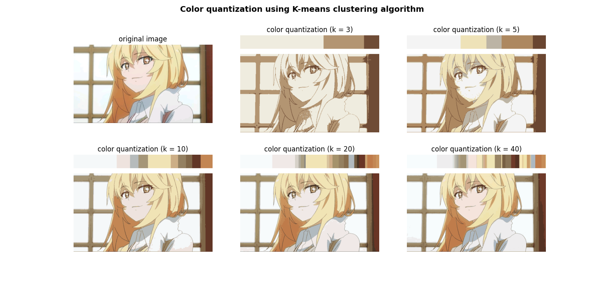

## k-means color quantization example
+ ##### cv2.kmeans(데이터, 군집 수, None, 알고리즘 수렴 기준, 중심 포인트 선택 횟수, 초기 중심 포인트 탐색 방법)
+ ##### data = np.float32(image).reshape((-1, 3)) -> data.shape() => (가로 X 세로, 3채널)
+ ##### criteria = (몰라, 알고리즘이 반복하는 횟수, 수렴 기준)

#### PSNR이 30 이상이라면 원본과 거의 비슷함
- - -
## Color quantization using K-means clustering algorithm example
+ ##### counter = collections.Counter(label.flatten()) - 각 레이블의 갯수가 몇 개씩 존재하는지 알 수 있는 객체를 반환
+ ##### print(f'k={k}: counter={counter}') - 내림차순으로 각 레이블의 갯수를 출력
+ ##### cv2.rectangle()함수를 통해 레이블의 색상과 내포된 양을 출력 

