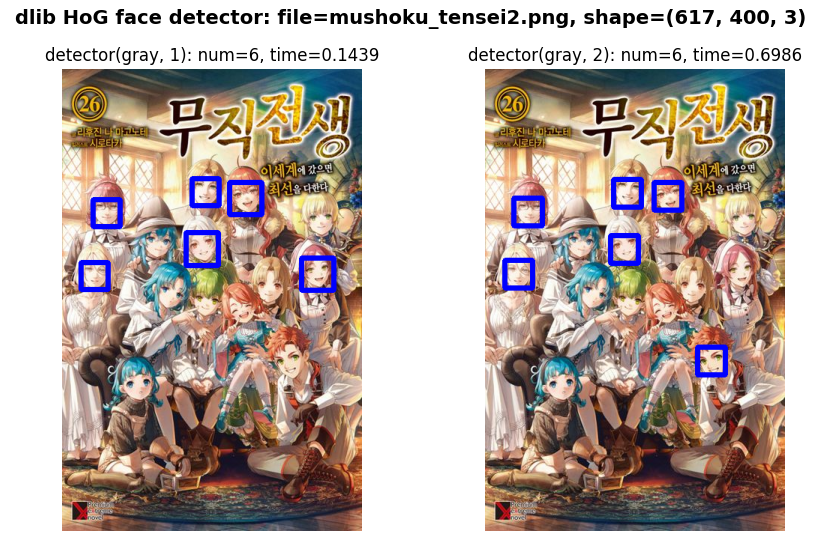

## face detection using xml
+ ##### cv2.CascadeClassifier(anime_cascade_path) - 캐스케이드 파일을 통한 애니메이션 얼굴 인식
+ ##### anime_face_cascade.detectMultiScale() - 이미지 또는 비디오에서 객체를 검출

- - -
## face detection using SSD
+ ##### cv.dnn.readNetFromCaffe(prototxt_path, caffe_model_path) - caffe 모델 구조와 prototxt 파일을 읽어 딥러닝 신경망을 생성
+ ##### confidence_threshold 수치 이상의 신뢰도를 가진 객체를 검출 시 화면에 표시

- - -
## face detection using dlib
+ ##### dlib.get_frontal_face_detector(): HOG(Histogram of Oriented Gradients) 기반의 얼굴 검출기를 반환
+ ##### detector(gray, up_scale): 이미지를 입력받아 얼굴을 검출.
+ ##### up_scale 인자는 이미지 크기를 확대할지 여부를 결정합니다.

