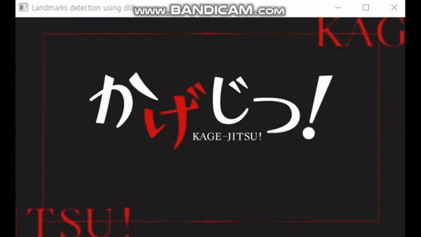
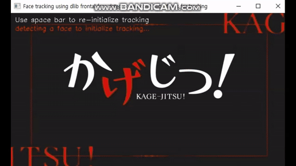

# facial landmarks
> ## landmarks detection dlib from image
> > + ##### shape_predictor_5_face_landmarks.dat - dlib 라이브러리를 사용하여 얼굴의 5개의 주요 랜드마크를 검출하는 데 사용되는 사전 학습된 모델
> > + ##### dlib.get_frontal_face_detector() - 얼굴 검출 객체 생성
> > + ##### dlib.shape_predictor(모델) - 랜드마크 검출 객체 생성.
> > 
- - -
> ## landmarks detection dlib from videofile
> > + ##### shape_predictor_68_face_landmarks.dat - dlib 라이브러리를 사용하여 얼굴의 다양한 특징을 나타내는 68개의 랜드마크를 검출하는 데 사용되는 사전 학습된 모델
> > + ##### rects = detector(gray, 0) -> 0 - 업샘플링(높을수록 성능 올라감)
> > + ##### detector() -> 이미지의 얼굴에 해당하는 경계상자 목록 반환
> > + ##### shape = predictor(gray, rect) -> 이미지에서 얼굴 영역을 받아 랜드마크를 검출하여 반환
> > 
- - -
# face tracking
> ## face tracking DCF from image
> > + ##### detector = dlib.get_frontal_face_detector() - 얼굴 검출기 반환
> > + ##### detector - 주어진 이미지에서 얼굴 영역을 찾아내는 역할
> > + ##### tracker = dlib.correlation_tracker() - 상관 추적기 생성
> > + ##### tracker - 주어진 이미지에서 특정 객체를 추적하는 데 사용
> > 이전 프레임에서 추적하려는 객체의 위치를 지정하면, 상관 추적기는 해당 객체를 다음 프레임에서 추적 
> > 
- - -
> ## face tracking DCF from video
> > + ##### tracker.update(frame) - 상관 추적기의 update() 메서드는 새로운 프레임(frame)을 사용하여 추적기를 업데이트함
> > + ##### tracker.get_position() - 추적된 객체의 위치를 가져옵니다 
> > 

