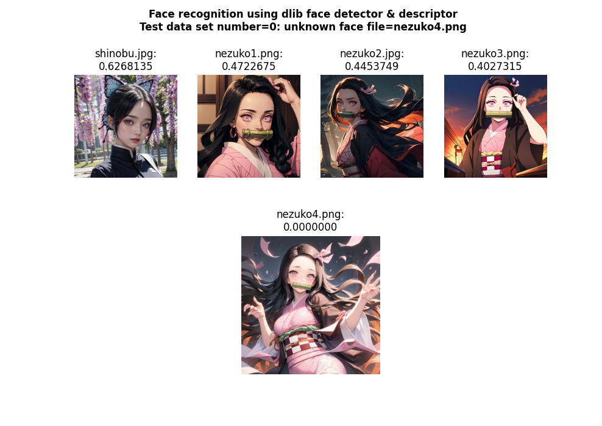

# compare faces with dlib
> ## compare faces dlib
> > + ##### dlib.face_recognition_model_v1(모델) - 얼굴 이미지로부터 128차원의 얼굴 특징 벡터(face descriptor)를 추출
> > + ##### list(np.linalg.norm(encodings - encoding_to_check, axis=1)) - 두 이미지 비교, 유클리드 거리를 계산하여 리스트로 반환
> > + ##### computed_distances = compare_faces(all_encodings, all_encodings[-1]) - 이 수치가 60 이하일 경우 비교 대상과 거의 일치하다고 여길 수 있음
> > 
