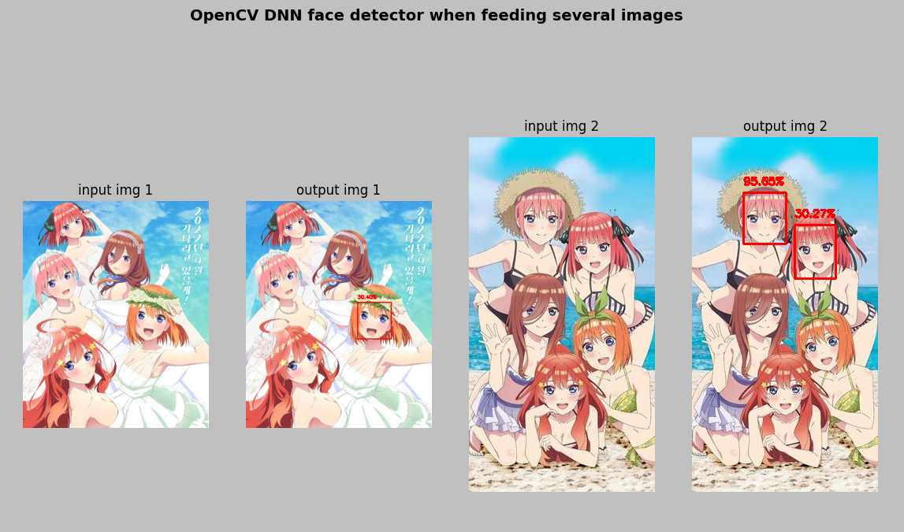
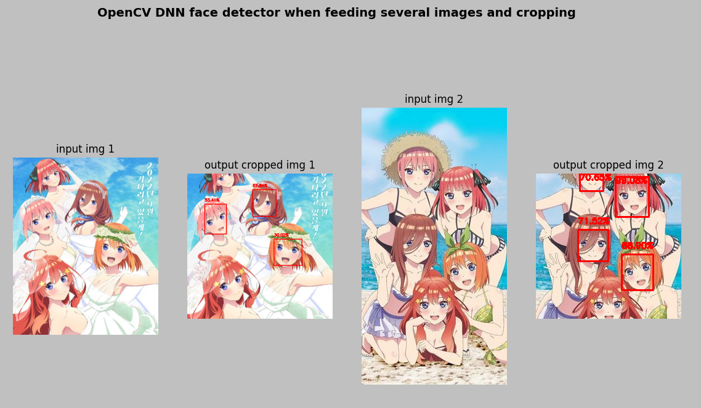

# 0_1 blob from images
> ## blob from image
> > + ##### cv2.dnn.blobFromImage() 함수를 이용하여 이미지를 블롭으로 변환 - 딥러닝 모델의 입력으로 사용됨
> > + ##### swap - BGR -> RGB 로 변경을 의미(딥러닝에서 RGB로 사용)
> > 
- - -
> ## blob from images
> > + ##### cv2.dnn.blobFromImages() 에 이미지 리스트를 입력
> > 
- - -
> ## blob from images cropping
> > + ##### 이미지에서 가로, 세로 중 작은 축을 기준으로 cropping
> > + ##### blob 에서 이미지로 변경되는 경우의 결과물은 crop 되지 않고 이미지가 전반적으로 가운데로 모임
> > + ##### crop 된 이미지는 위와 같은 가운데로 모이는 현상 없이 잘려진 이미지가 출력되는 것을 볼 수 있음
> > 
- - -
# 02_opencv face detection CNN
> ## face detection opencv CNN images
> > + ##### cv2.dnn.readNetFromCaffe() 함수를 통해 사전 훈련된 모델 로드
> > + ##### net.setInput(blob_images) - 변환된 블롭을 네트워크의 입력으로 설정
> > + ##### detections = net.forward() - 순방향 전달 수행 및 탐지 결과 반환
> > > ##### detections[0, 0, i, 0]: 이미지 ID
> > > ##### detections[0, 0, i, 1]: 클래스를 나타내는 값 (얼굴 탐지의 경우, 일반적으로 1)
> > > ##### detections[0, 0, i, 2]: 신뢰도 (confidence)
> > > ##### detections[0, 0, i, 3:7]: 경계 상자의 좌표 (x1, y1, x2, y2)
> > 
- - -
> ## face detection opencv CNN images_crop
> > 

