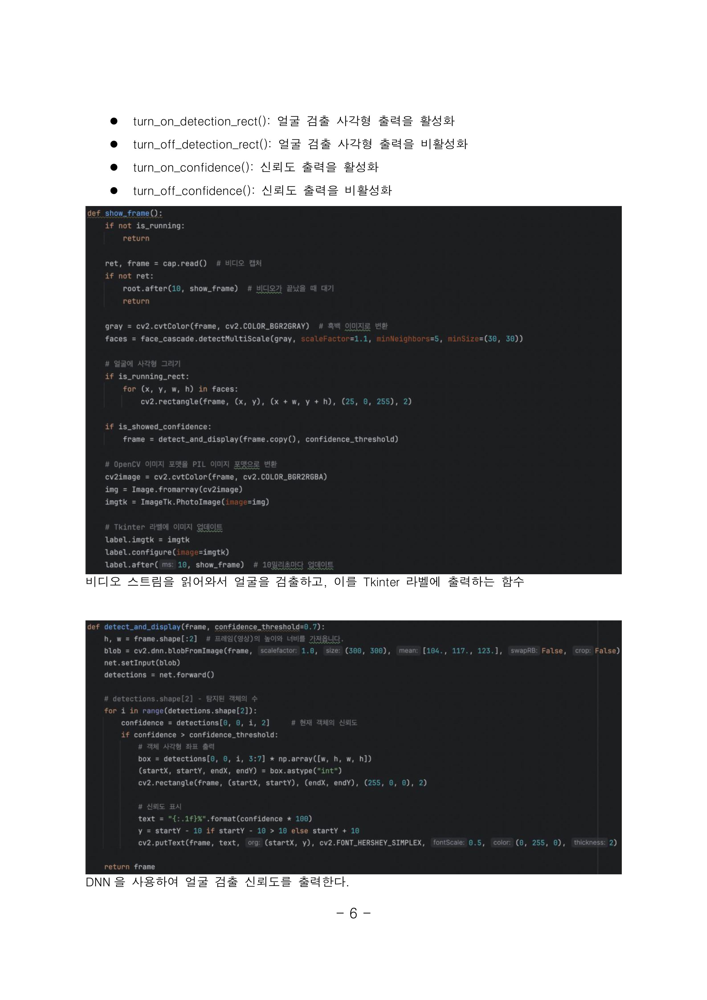
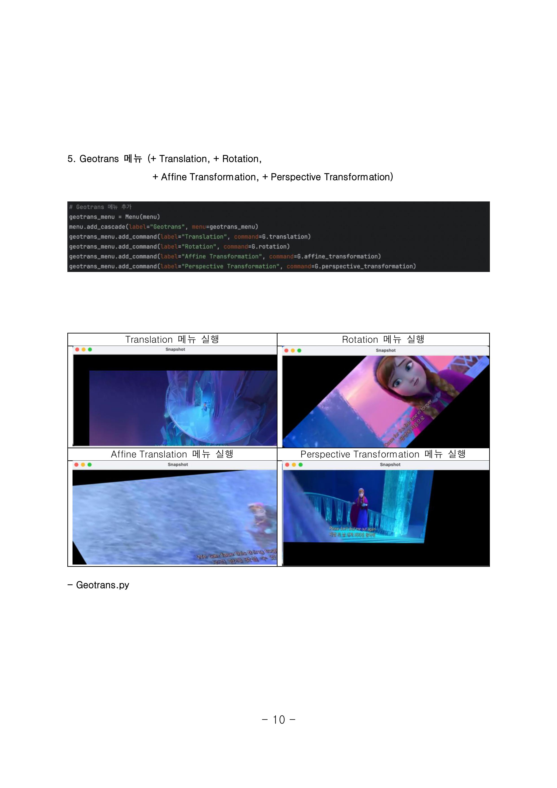
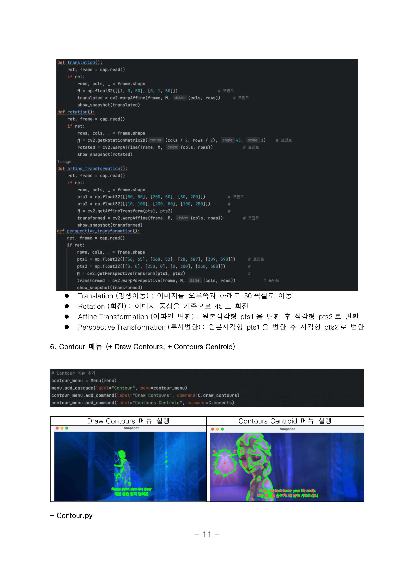
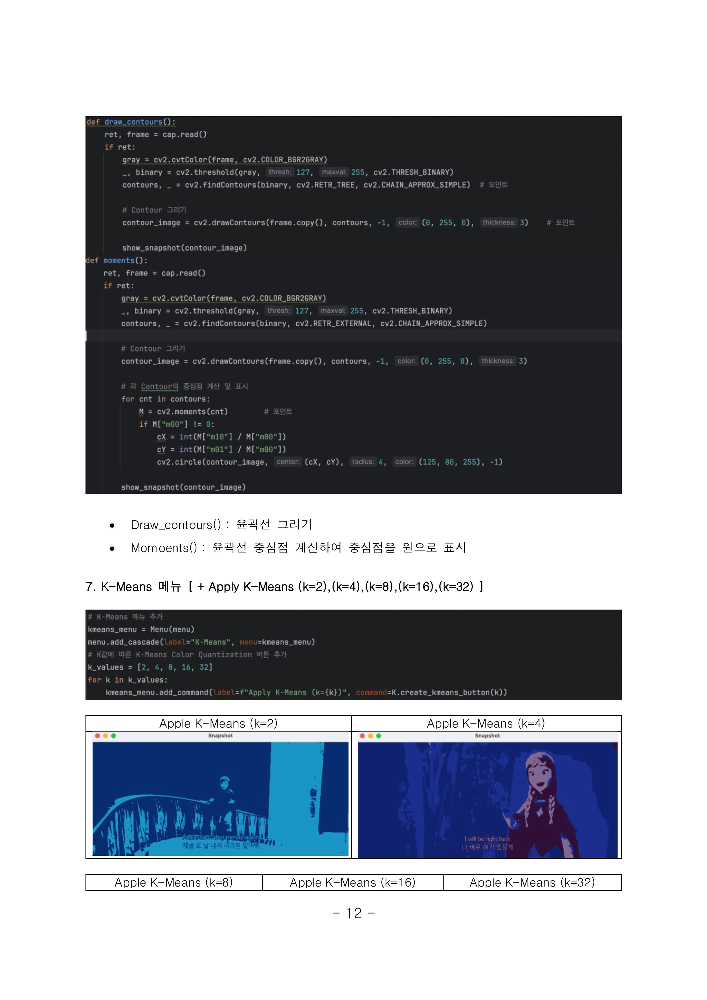
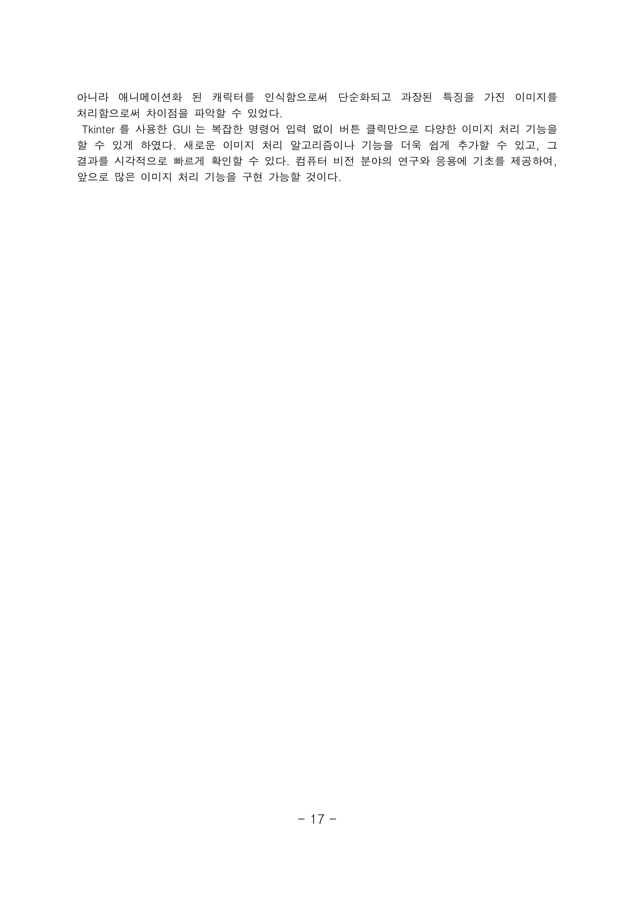

### 🧠 애니메이션 캐릭터 얼굴 인식 GUI 프로그램

- **분야**: 컴퓨터 비전 / 얼굴 인식 / 영상 처리  
- **개발 기간**: 2024.04 ~ 2024.06  
- **사용 기술**: Python, OpenCV, Tkinter, DNN

---

- **프로젝트 개요**  
  영상 속 인물 및 애니메이션 캐릭터의 얼굴을 실시간으로 인식하고,  
  신뢰도(Confidence) 및 인식 영역을 시각화하는 GUI 프로그램입니다.

---

- **주요 기능**:
  - DNN 기반 얼굴 인식 및 신뢰도 출력
  - 애니메이션 캐릭터용 LBP Classifier 적용
  - Threshold, 기하 변환, 윤곽선 추출 등 이미지 처리 기능 탑재
  - Tkinter 기반 메뉴형 GUI로 손쉬운 사용 가능

---

- **기여 내용**:
  - GUI 설계 및 기능 이벤트 연동
  - 얼굴 인식 결과 시각화 및 저장 기능 구현
  - 데이터 수집 자동화 및 캐릭터 인식 실험 수행

---

- **성과**:
  - 실제 인물 대비 애니메이션 캐릭터 인식 정확도 차이 분석
  - GUI 기반 영상 처리 툴로 확장 가능성 확보

---

- **코드**:
  - [__init__.py](https://github.com/LimJuHyung1/ComputreVision/blob/main/2%EC%B0%A8%EA%B3%BC%EC%A0%9C/%EC%86%8C%EC%8A%A4/__init__.py)
  - [Contour.py](https://github.com/LimJuHyung1/ComputreVision/blob/main/2%EC%B0%A8%EA%B3%BC%EC%A0%9C/%EC%86%8C%EC%8A%A4/Contour.py)
  - [Geotrans.py](https://github.com/LimJuHyung1/ComputreVision/blob/main/2%EC%B0%A8%EA%B3%BC%EC%A0%9C/%EC%86%8C%EC%8A%A4/Geotrans.py)
  - [K_means.py](https://github.com/LimJuHyung1/ComputreVision/blob/main/2%EC%B0%A8%EA%B3%BC%EC%A0%9C/%EC%86%8C%EC%8A%A4/K_means.py)
  - [Modules.py](https://github.com/LimJuHyung1/ComputreVision/blob/main/2%EC%B0%A8%EA%B3%BC%EC%A0%9C/%EC%86%8C%EC%8A%A4/Modules.py)
  - [Select_Cascade.py](https://github.com/LimJuHyung1/ComputreVision/blob/main/2%EC%B0%A8%EA%B3%BC%EC%A0%9C/%EC%86%8C%EC%8A%A4/Select_Cascade.py)
  - [Threshold.py](https://github.com/LimJuHyung1/ComputreVision/blob/main/2%EC%B0%A8%EA%B3%BC%EC%A0%9C/%EC%86%8C%EC%8A%A4/Threshold.py)
  - [Video_Control.py](https://github.com/LimJuHyung1/ComputreVision/blob/main/2%EC%B0%A8%EA%B3%BC%EC%A0%9C/%EC%86%8C%EC%8A%A4/Video_Control.py)
 

# Report 
> 
> 
> 
> 
> 
> 
> 
> 
> 
> 
> 
> 
> 
> 
> 
> 
> 
