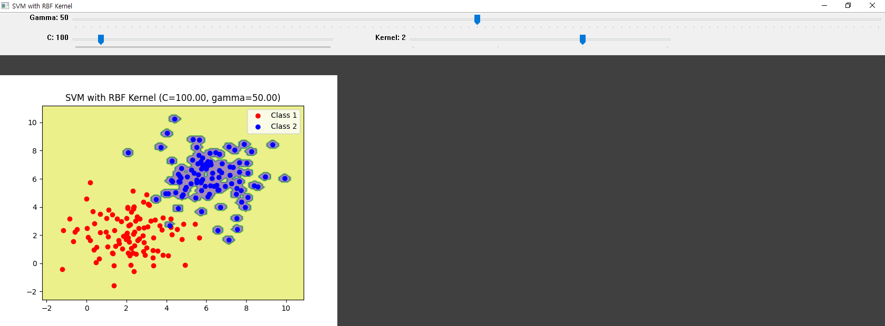
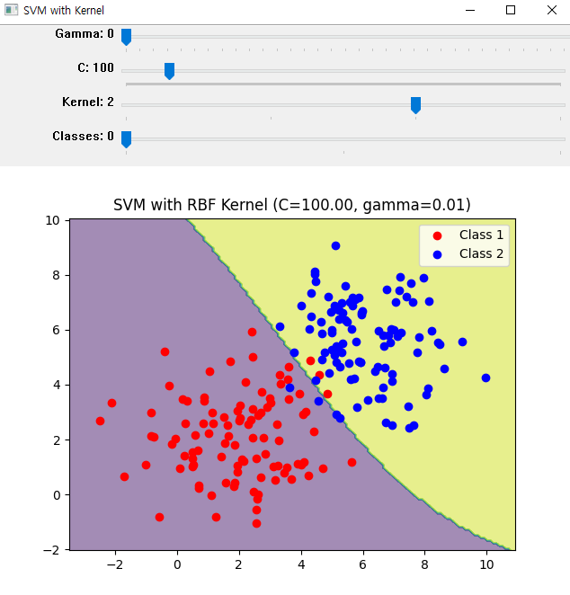
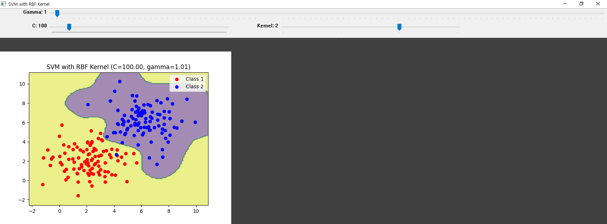
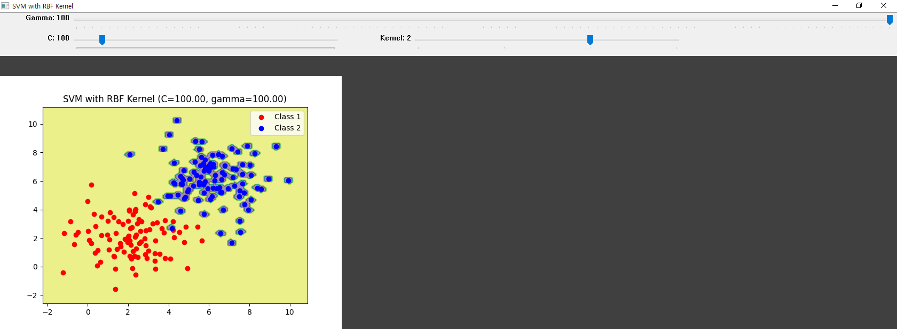
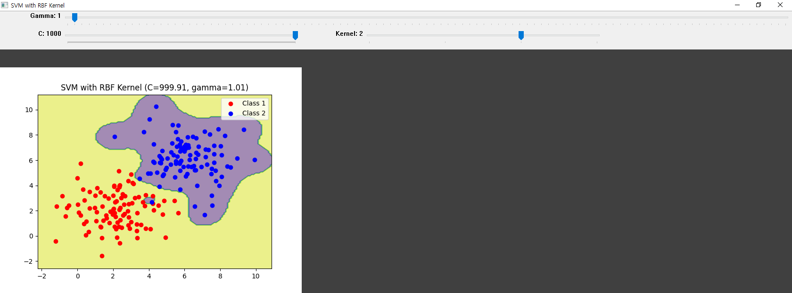
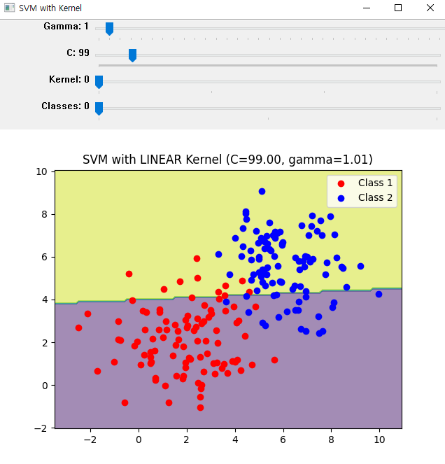
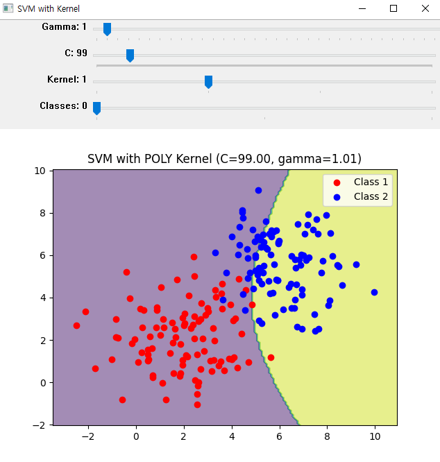
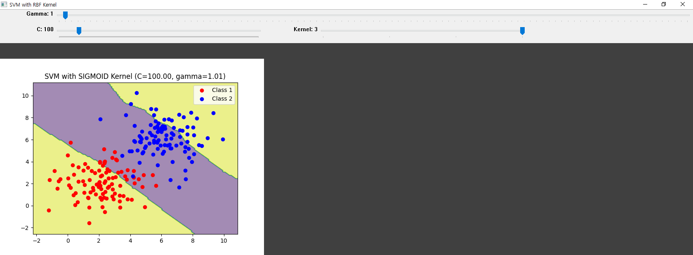
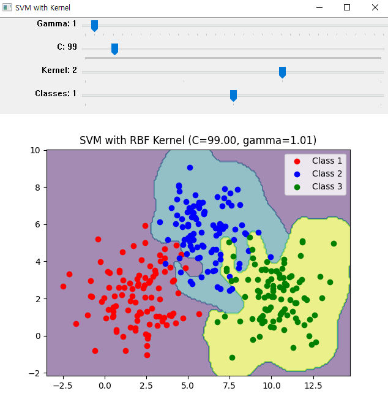
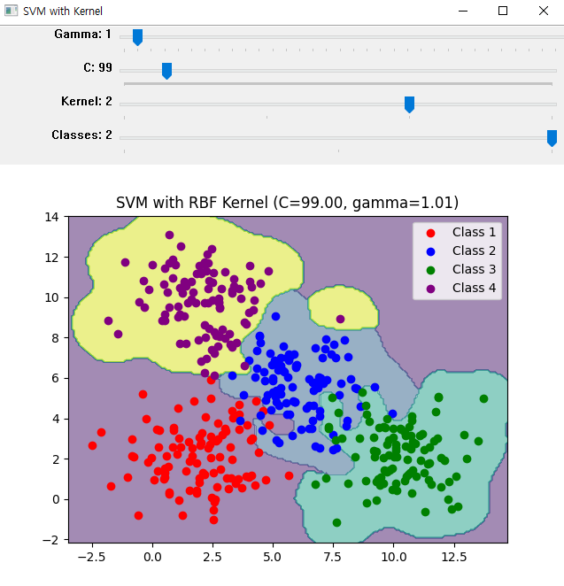

# SVM1
## 1. 문제 요약
> ### &nbsp;&nbsp;&nbsp;&nbsp;SVM Introduction 1.2절의 RBF(Radial Basic Function) Kernel 참조  
> ### &nbsp;&nbsp;&nbsp;&nbsp;gamma에 따른 분류 특성을 보여주는 사례와 같은 프로그램의 작성  
>  
> > + #### 단계 1: gamma에 따라 몇 개의 그림을 한 화면에 matplotlib로 도시
> > + #### 단계 2: 가능한 클래스를 2~4개 정도 선택가능하도록 설계 바람.
> > #### ---------------------------------------- 선택 사항 ----------------------------------------  
> > + #### 단계 3: trackbar로 감마를 제어 (감마 값은 화면에서 문자로 출력)
> > + #### 단계 4: 트랙 바를 하나 더 추가하여 C값의 설정도 바꿀 수 있음(화면에 값 출력)
> > + #### 단계 5: 트랙 바 추가하여 커널 함수를 고를 수 있었으면 좋겠음(2.1절 사례처럼)


## <br/> 2. 코드
```python
# 03조 (임주형,이세비,최하은)

"""
SVM1 - gamma에 따른 분류 특성을 보여주는 사례와 같은 프로그램의 작성
=> gamma, C, kernel에 따라 그림을 화면에 matplotlib로 도시
"""

import cv2
import numpy as np
import matplotlib.pyplot as plt

# 랜덤한 네 개의 클래스 데이터 생성
mean1 = [2, 2]  # 클래스 1 평균값
cov1 = [[2, 0], [0, 2]]  # 클래스 1 x, y 축에 퍼져있는 정도
data1 = np.random.multivariate_normal(mean1, cov1, 100)
label1 = np.zeros((100, 1))  # 해당 레이블에 적용되는 데이터는 0의 레이블을 가짐

mean2 = [6, 6]  # 클래스 2 평균값
cov2 = [[2, 0], [0, 2]]
data2 = np.random.multivariate_normal(mean2, cov2, 100)
label2 = np.ones((100, 1))  # 해당 레이블에 적용되는 데이터는 1의 레이블을 가짐

mean3 = [10, 2]  # 클래스 3 평균값
cov3 = [[2, 0], [0, 2]]
data3 = np.random.multivariate_normal(mean3, cov3, 100)
label3 = 2 * np.ones((100, 1))  # 해당 레이블에 적용되는 데이터는 2의 레이블을 가짐

mean4 = [2, 10]  # 클래스 4 평균값
cov4 = [[2, 0], [0, 2]]
data4 = np.random.multivariate_normal(mean4, cov4, 100)
label4 = 3 * np.ones((100, 1))  # 해당 레이블에 적용되는 데이터는 3의 레이블을 가짐

# 모든 데이터와 레이블을 하나로 합침
all_data = [data1, data2, data3, data4]
all_labels = [label1, label2, label3, label4]

# 초기 감마 값 설정
gamma = 1.0
# 초기 C 값 설정
C = 1
# 초기 커널 함수 설정
kernel_type = cv2.ml.SVM_RBF
kernel_str = "RBF"
# 선택한 클래스의 수 설정
num_classes = 4


# 트랙바 콜백 함수 (감마)
def on_gamma_trackbar(val):
    global gamma
    gamma = val / 100.0 * 99.99 + 0.01  # 감마 값을 0.01에서 100 사이의 값으로 변환
    update_plot()


# 트랙바 콜백 함수 (C)
def on_c_trackbar(val):
    global C
    C = val / 100.0 * 99.99 + 0.01  # C 값을 0.01에서 100 사이의 값으로 변환
    update_plot()


# 트랙바 콜백 함수 (커널 함수)
def on_kernel_trackbar(val):
    global kernel_type
    global kernel_str
    if val == 0:  # 선형 커널
        kernel_type = cv2.ml.SVM_LINEAR
        kernel_str = "LINEAR"
    elif val == 1:  # 다항 커널
        kernel_type = cv2.ml.SVM_POLY
        kernel_str = "POLY"
    elif val == 2:  # RBF 커널
        kernel_type = cv2.ml.SVM_RBF
        kernel_str = "RBF"
    elif val == 3:  # 시그모이드 커널
        kernel_type = cv2.ml.SVM_SIGMOID
        kernel_str = "SIGMOID"
    update_plot()


# 트랙바 콜백 함수 (클래스 수)
def on_class_trackbar(val):
    global num_classes
    num_classes = val + 2  # 최소 2개의 클래스를 선택하게 함
    update_plot()


# 결정 경계 업데이트 함수
def update_plot():
    # 선택한 클래스 데이터 병합
    selected_data = np.vstack(all_data[:num_classes])
    selected_labels = np.vstack(all_labels[:num_classes])

    # SVM 모델 생성
    svm = cv2.ml.SVM_create()
    svm.setKernel(kernel_type)  # 커널 함수 설정

    # 모델 유형 설정 - C-SVC : 클래스 간의 간격을 최대화하는 선형 분류 수행
    svm.setType(cv2.ml.SVM_C_SVC)
    svm.setC(C)  # C 설정
    svm.setGamma(gamma)  # gamma 값 적용

    if kernel_type == cv2.ml.SVM_POLY:
        svm.setDegree(3)  # 다항 커널의 degree 설정
    if kernel_type == cv2.ml.SVM_SIGMOID or kernel_type == cv2.ml.SVM_POLY:
        svm.setCoef0(0.0)  # 다항 및 시그모이드 커널의 coef0 설정

    # SVM 모델 훈련
    svm.train(selected_data.astype(np.float32), cv2.ml.ROW_SAMPLE, selected_labels.astype(np.int32))

    # 결정 경계 생성
    x1_min, x1_max = selected_data[:, 0].min() - 1, selected_data[:, 0].max() + 1
    x2_min, x2_max = selected_data[:, 1].min() - 1, selected_data[:, 1].max() + 1

    # x1 및 x2의 최소에서 최대까지 0.1 간격으로 그리드 포인트를 생성
    xx1, xx2 = np.meshgrid(np.arange(x1_min, x1_max, 0.1),
                           np.arange(x2_min, x2_max, 0.1))

    # xx1과 xx2를 펼쳐서 각 포인트를 하나의 특성 벡터로 생성
    mesh_data = np.c_[xx1.ravel(), xx2.ravel()]

    # svm모델을 사용해서 경계를 생성
    _, decision_values = svm.predict(mesh_data.astype(np.float32))

    # xx1의 형태 재구성 -> 결정 경계의 시각화 가능
    decision_values = decision_values.reshape(xx1.shape)

    # 시각화
    plt.clf()  # plt 갱신
    plt.contourf(xx1, xx2, decision_values, alpha=0.5)  # 결정 경계의 등고선 시각화

    # 선택한 클래스 데이터 시각화
    colors = ['red', 'blue', 'green', 'purple']
    labels = ['Class 1', 'Class 2', 'Class 3', 'Class 4']
    for i in range(num_classes):
        plt.scatter(all_data[i][:, 0], all_data[i][:, 1], color=colors[i], label=labels[i])

    plt.title(f'SVM with {kernel_str} Kernel (C={C:.2f}, gamma={gamma:.2f})')
    plt.legend()

    # Matplotlib 그래프를 이미지로 변환
    plt.savefig('tmp_plot.png')

    # OpenCV로 이미지 불러오기
    img = cv2.imread('tmp_plot.png')
    cv2.imshow('SVM with Kernel', img)


# 초기화 및 트랙바 생성
cv2.namedWindow('SVM with Kernel')
cv2.createTrackbar('Gamma', 'SVM with Kernel', 50, 100, on_gamma_trackbar)
cv2.createTrackbar('C', 'SVM with Kernel', 100, 1000, on_c_trackbar)
cv2.createTrackbar('Kernel', 'SVM with Kernel', 2, 3,
                   on_kernel_trackbar)  # 0: Linear, 1: Polynomial, 2: RBF, 3: Sigmoid
cv2.createTrackbar('Classes', 'SVM with Kernel', 2, 2, on_class_trackbar)  # 2: 최소 2개, 최대 4개 클래스 선택

# 트랙바 초기값 설정
cv2.setTrackbarPos('Kernel', 'SVM with Kernel', 2)
cv2.setTrackbarPos('Classes', 'SVM with Kernel', 0)

# 초기 플롯 생성
update_plot()

# 트랙바 이벤트 처리
while True:
    key = cv2.waitKey(1) & 0xFF
    if key == 27:  # ESC 키를 누르면 종료
        break

cv2.destroyAllWindows()
```
## <br/> 3. 결과
> + ### 실행 초기 상태(gamma = 50, C = 100, Kernel = RBF)
> 
> + ### gamma = 0.01
> 
> + ### gamma = 1
> 
> + ### gamma = 100
> 
- - -
> + ### C = 0.01
> 
> + ### C = 1000
> 
- - -
> + ### Kernel = Linear
> 
> + ### Kernel = Polynomial
> 
> + ### Kernel = Sigmoid
> 
- - -
> + ### Class 3
> 
> + ### Class 4
> 


## <br/> 4. 결론
> + #### 단계 1: 여러 값을 수정하면서 갱신된 상태의 그림을 볼 수 있음(사진을 저장하고 이를 보여주는 매커니즘).
> + #### 단계 2: 클래스를 트랙바를 통해 수정 가능
> + #### 단계 3: gamma 수정 가능 및 화면 출력 완료.
> + #### 단계 4: C 수정 가능 및 화면 출력 완료.
> + #### 단계 5: 0: Linear, 1: Polynomial, 2: RBF, 3: Sigmoid
